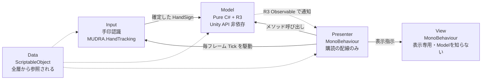
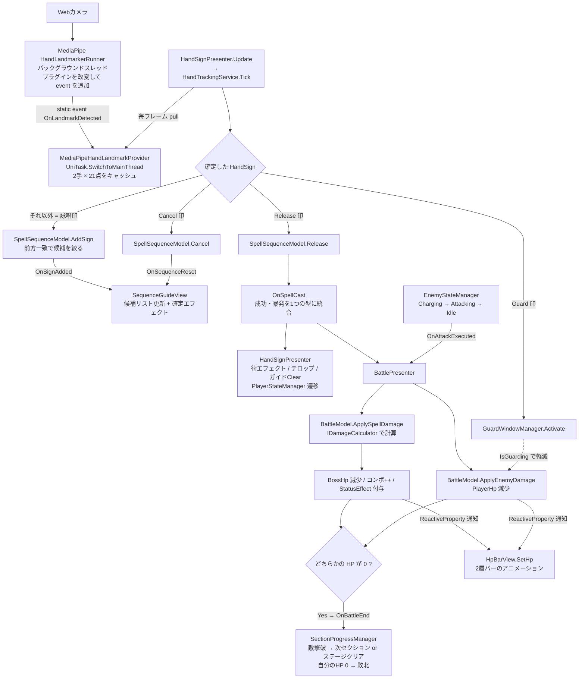

# 🗺️ アーキテクチャ概観：MUDRA

> **ドキュメント種別:** アーキテクチャ復習ドキュメント
> **作成日:** 2026/09/18
> **最終更新:** 2026/10/05（B4完了時点に更新）
> **対象コミット:** `b4034df` + B4の未コミット変更
> **対象コード:** `Assets/_MUDRA/Scripts`（64ファイル / 約6,560行。うちEditor生成ツール1本・約590行）
> **ステータス:** 現状スナップショット

---

## 0. このドキュメントの位置づけ

`docs/` には3種類のドキュメントがある。役割が違うので混ぜて読まないこと。

| ドキュメント | 役割 | 時制 |
|---|---|---|
| `specification_MUDRA.md`（v1.3） | **設計の正典。** 仕様駆動開発の基準であり、これから作るものも含む | 未来を含む |
| `devlog/dev_log_*.md` | 各マイルストーン完了時点の実装記録と設計判断の理由 | 当時の過去 |
| **本書（`architecture/`）** | **いま動いているコードの断面図。** どこに何があるかを思い出すための地図 | 現在 |

仕様書に書いてあるが未実装のものは [§8 仕様書とのギャップ](#8-仕様書とのギャップ簡易) にまとめてある。

- [01_hand_input.md](01_hand_input.md) — 手印認識パイプライン（Input層）の詳解
- [02_battle_system.md](02_battle_system.md) — Model / Presenter / View / Data の詳解

---

## 1. 技術スタック

出典: `MUDRA/Packages/manifest.json`, `MUDRA/Assets/packages.config`

| 技術 | 用途 |
|---|---|
| Unity 6 + URP（2D） | 実行環境。ビジュアル方針は2Dで確定（B1） |
| MediaPipeUnityPlugin | Webカメラからの手ランドマーク検出（21点 × 最大2手） |
| **R3**（NuGetForUnity経由） | Model → Presenter の通知。`ReactiveProperty` / `Subject` / `Observable` |
| **UniTask** | 非同期タイマー全般。敵行動ループ、硬直タイマー、スレッド切替 |
| **LitMotion** | View側のトゥイーン演出（HPバー、テロップ、確定エフェクト） |
| TextMeshPro | UIテキスト（日本語フォントは NotoSansJP SDF） |

DIコンテナは**使っていない**。手書きの Composition Root（`BattleInitializer`）で全部組み立てる。

---

## 2. フォルダ構成

プロジェクト固有のコードは `Assets/_MUDRA/` 配下のみ。`Assets/` 直下のそれ以外（`MediaPipeUnity/`, `TextMesh Pro/`, `Packages/`）はサードパーティ。

```
Assets/_MUDRA/
├── Scenes/InGame.unity          … 唯一のシーン
├── ScriptableObject/            … 術・敵・攻撃・ステージの定義アセット、演出の時間表・色（Presentation/）
├── Prefabs/ Particle/ Sprites/ Fonts/
└── Scripts/
    ├── Data/                    … ScriptableObject定義とenum
    │   SpellData / EnemyData / EnemyAttackData / EnemyAction / StageData(+StageSection) / SpellEnums
    │   PresentationTimingData（演出の時間表） / BattlePaletteData（意味の色）
    ├── Input/                   … 手印認識（namespace MUDRA.HandTracking）
    │   IHandLandmarkProvider / MediaPipeHandLandmarkProvider
    │   HandTrackingService(484行・中核) / HandLandmark / FingerState / HandSignEnum
    │   └── HandTracking/TempHandTrackingRunner … 旧ドライバ（本番経路ではない）
    ├── Model/                   … Pure C#。Unity非依存のゲームロジック
    │   SpellSequenceModel / BattleModel / SpellCastResult
    │   PlayerStateManager+PlayerPhase / EnemyStateManager+EnemyPhase
    │   SectionProgressManager+SectionPhase … ステージ内のセクション進行
    │   ├── State/               … プレイヤーのStateパターン（Idle/Chanting/Releasing）
    │   ├── StatusEffect/        … 時限効果（DoT/Stun/HoT）とガード受付窓
    │   └── Strategy/            … ダメージ計算3種
    ├── Presenter/               … Model購読 → View呼び出しの配線のみ
    │   BattleInitializer(起動) / HandSignPresenter / BattlePresenter / EnemyPresenter
    ├── View/                    … 表示専用MonoBehaviour。Modelを知らない（詳細は 02 §12）
    │   HUD:  HpBarView / SequenceGuideView / SpellTelopView / DamageNumberView / ComboView
    │         StatusIconView / StageTitleView / BattleResultView / GuardView / ScreenFlashView
    │   世界: EnemyView / BackgroundView / SpellEffectView / CameraShakeView
    │   ボス: BossEncounterView
    │   共有: BattleUiConstants（調整対象でない共有値）
    ├── Debug/                   … #if UNITY_EDITOR || DEVELOPMENT_BUILD
    │   DebugKeyboardInput / DebugMenuView / ThumbAngleDebugger / HandTrackingActiveTest
    └── Editor/                  … ビルド対象外。ランタイムから参照しない
        B3ContentGenerator … 敵・攻撃・ステージSOの一括生成（メニュー MUDRA/Generate B3 Content）
```

`.asmdef` は無く、全コードが `Assembly-CSharp` にコンパイルされる。**自動テストは存在しない**（`Debug/HandTrackingActiveTest.cs` はテストではなく毎フレームのログ出力）。

---

## 3. レイヤーと依存方向



| レイヤー | 規約 |
|---|---|
| **Input** | 唯一のMonoBehaviourは `MediaPipeHandLandmarkProvider`。`HandTrackingService` はPure C# |
| **Model** | **MonoBehaviour非継承・Unity API不使用**。テスト容易性のための方針（A1） |
| **Presenter** | ロジックを持たない。購読の配線と、確定した値をViewのメソッドに渡すだけ |
| **View** | Modelを参照しない。`SetHp(int,int)` のような命令的メソッドを公開するだけの受け身 |

**通知方向は常に Model → Presenter（R3購読）→ View（メソッド呼び出し）。** 逆流はしない。

---

## 4. 起動シーケンス

`BattleInitializer.Awake()`（`Presenter/BattleInitializer.cs:39`）が Composition Root。シーンに1つだけ置く。

`Awake` は「検証 → Model生成 → 注入 → 終了処理の購読 → ステージ開始」の順。生成するModelは**すべてステージ全体で生存**し、セクション遷移で作り直すものは無い（購読の張り直しが発生しない）。

1. **`ValidateStageData()`** — `_allStages` が空、または要素0（開始ステージ）が未設定なら中断
2. **`BuildStageScopeModels()`** — Model 8種を生成。`EnemyStateManager` / `BattleModel` は開始ステージの先頭セクションの敵で初期化する
   - **循環依存の解消** — `StatusEffectFactory` に `BattleModel.ApplyDotDamage` / `ApplyHeal` / `EnemyStateManager.ApplyStun` / `EndStun` を **`Action` として**渡し、`BattleModel.SetStatusEffectDependencies()` で後から注入する（A5）
3. **`InjectPresenters()`** — 各Presenterへの注入と、デバッグメニューへの `Inject(...)`（`#if UNITY_EDITOR || DEVELOPMENT_BUILD`）
4. **`SubscribeStageEnd()`** — `OnStageCleared` / `OnGameOver` → `StatusEffectManager.ClearAll()` → `EnemyStateManager.StopLoop()`（この順序は意図的。Stun解除が走っても最後に必ず止まるようにする）
5. **ステージ開始** — `SectionProgressManager.StartStage(_allStages[0])`。敵の流し込みと行動ループの開始はここから先で行われる（[02 §11](02_battle_system.md)）

`OnDestroy()` で `CompositeDisposable` と全Modelを `Dispose()` する。シングルトン・static は**プロジェクトコードには存在しない**（唯一の例外はMediaPipe側のstatic event、[01](01_hand_input.md) 参照）。

---

## 5. データフロー全体図



---

## 6. 毎フレーム駆動されているもの

Tick/Update で回るものと、UniTaskタイマーで動くものが明確に分かれている。

| 駆動元 | 呼ぶもの |
|---|---|
| `HandSignPresenter.Update()` | `HandTrackingService.Tick()` — 認識パイプライン全体 |
| `BattlePresenter.Update()` | `StatusEffectManager.Tick(deltaTime)` — DoT/Stunの時間経過 |
| `BattlePresenter.Update()` | `GuardWindowManager.Tick(deltaTime)` — ガード受付窓の残り時間 |
| UniTaskループ | `EnemyStateManager.RunLoopAsync` — 敵の行動サイクル |
| UniTaskタイマー | `ReleasingState` — 発動後250msの硬直 |

コルーチンと `async void` は使っていない。非同期は全てUniTask（`UniTaskVoid` + `.Forget()`、キャンセルは `CancellationTokenSource`）。

---

## 7. シーンとアセット

### InGame.unity（唯一のシーン）

| GameObject | 載っているもの |
|---|---|
| `Solution` | MediaPipe の `HandLandmarkerRunner`（カメラ入力〜推論） |
| `Main Canvas`（Screen Space - Camera） | MediaPipe サンプル由来。右下のカメラ映像。Sorting Layer `CameraPreview`（最前面） |
| Provider用 | `MediaPipeHandLandmarkProvider` + `TempHandTrackingRunner` + `HandTrackingActiveTest` |
| `BattleSystem` | `BattleInitializer` / `HandSignPresenter` / `BattlePresenter` / `EnemyPresenter` |
| `BattleField`（ワールド） | `Background`（`BackgroundView`）/ `Enemy`（`EnemyView`、子に `Body` と `EffectSpawnPoint`）/ `PlayerEffectSpawnPoint` / `BossDimOverlay` |
| `BattleCanvas`（Overlay・HUD） | HPバー×2 / ガイド / テロップ / 数字 / コンボ / 状態アイコン / ステージ名 / 決着 / フラッシュ / ガード枠 / ボス演出 |
| `Main Camera` | Orthographic（size 5）。`CameraShakeView` |
| Debug用 | `DebugMenuView` / `DebugKeyboardInput` |

**描画順（B4）:** Sorting Layer `Background` < `Enemy` < `Effect` < `CameraPreview`、その上に Overlay の `BattleCanvas`。背景・敵・術エフェクトはワールドの SpriteRenderer / Particle System で描き、HUD だけ Overlay に置く（Overlay に背景や敵を置くとパーティクルが裏に隠れるため）。

`BattleInitializer` の設定値: 術7種すべて登録 / `_allStages` = SD_Stage01〜04 / `_playerMaxHp` = 100。

### 術アセット（`ScriptableObject/Player/`）

| アセット | 術名 | シーケンス | 属性 | 威力 | 計算方式 | 副次効果 |
|---|---|---|---|---|---|---|
| WindBlade | 風刃 | 合 | Wind | 30 | SingleHit | — |
| WaterCrow | 水爪 | 刃 → 握 | Water | 30 | SingleHit | — |
| IceWind | 氷風 | 開 → 指 → 握 | Wind | 50 | SingleHit | — |
| Lightning | 雷連撃 | 指 → 刃 | Thunder | 50 | MultiHit ×5 | Stun 3秒 |
| Fireball | 火炎弾 | 掌 → 握 | Fire | 50 | DoT | DamageOverTime 3秒 |
| CrossBlade | 双刃 | 双（両手チョキ） | Earth | 40 | SingleHit | — |
| Heal | 回復術 | 開 → 掌 | Earth | 0 | SingleHit | HealOverTime 5秒（healPower 10） |

### 敵・攻撃・ステージアセット

4ステージ / 敵15種（雑魚ユニーク8 + 派生3 + ボス4）/ 攻撃23種。ファイル名は `EA_` / `ED_` / `SD_` プレフィックス + 英語（仕様書 §3-2 の命名規則）。
全数値の一覧と設計意図は `docs/B3_enemy_stage_content.md` が正。**値の変更は `Editor/B3ContentGenerator.cs` の定義表を直して再実行する**（アセットを直接いじると次回の再実行で上書きされる）。

| ステージ | セクション（最後がボス） |
|---|---|
| SD_Stage01_SealedVillage 封土の里 | 泥ころ → 枯れ木霊 → **泥人形** |
| SD_Stage02_SunkenShrine 水底の社 | 河童 → 岩泥ころ → 蟹坊主 → **水蛇** |
| SD_Stage03_BurningTemple 焔の廃寺 | 鬼火 → 燃え木霊 → 火車 → **炎魔** |
| SD_Stage04_ShadowAbyss 影の深淵 | 影法師 → 影鬼火 → 鵺 → **影龍** |

`isHeavy` は攻撃ごとに固定（同じ攻撃はどの敵が使っても大技か否かが変わらない）。生成スクリプトが攻撃テーブルから自動で設定する。

---

## 8. 仕様書とのギャップ（簡易）

仕様書 v1.5 に設計はあるがコードに存在しないもの。次に作るものの目次として使う。

| 未実装のもの | 仕様書の該当箇所 | 影響 |
|---|---|---|
| `GameStateManager` / `GamePhase` | §4-1 | 画面遷移が無い。InGame直起動のみ（B5） |
| 本番のアート | §9-4 | 敵は既定スプライト＋名前から決めた色、背景は1枚の仮素材。`EnemyData.sprite` / `StageData` の背景 / `SpellData.cutInSprite` / `EnemyAttackData.effectPrefab` を差し替えるだけで入る |
| リザルト画面 | §4-1 | 決着は `BattleResultView` の「討伐」「敗北」表示のみ（B5） |
| キャリブレーション / チュートリアル | §4-1 | しきい値は C# の const 固定（B6） |
| サウンド（`castSE` / `attackSE` / `bgm`） | §3-2 | フィールドはあるが未使用（B7） |
| `StatusEffectType.Slow` | §3-1 | enumにあるが実装クラスが無い |

逆に**仕様書に無く実装が先行している**もの: `HandSign.DoubleScissors`（B2 Step3 の10本指パターン第1号）。

---

## 9. 開発再開ガイド

### とりあえず動かす

1. `Assets/_MUDRA/Scenes/InGame.unity` を開いて Play
2. Webカメラに手をかざす。36フレーム（約0.6秒）同じ形を保つと印が確定する

### カメラ無しでテストする（推奨）

`HandSignPresenter` の `_debugKeyboardInput` に シーン上の `DebugKeyboardInput` を割り当てる。**現在は未割り当て = 通常のカメラモード**。割り当てると `HandTrackingService.Tick()` は回らなくなり、キー入力が直接 `HandleSignConfirmed` に流れる。

| キー | 印 |
|---|---|
| `1` `2` `3` `4` `5` | 開 / 握 / 指 / 刃 / 掌 |
| `U` | 合（Union） |
| `Space` | 発動印 |
| `Backspace` | 解除印 |
| `G` | ガード |
| `R` | シーンリロード（バトルリセット） |

`F1` でデバッグメニュー（OnGUIオーバーレイ）— HP増減、StatusEffect強制付与、無敵モード、FPS表示。

### 新しい術を追加する

1. Project ビューで右クリック → `Create > MUDRA > SpellData`
2. `sequence` に詠唱印を並べる（発動印 `Release` は**含めない**）
3. `BattleInitializer` の `_allSpells` に登録する
4. 演出: `effectPrefab`（`Particle/Spell/PS_*.prefab` を参考に）と `element`（カットインの帯の色）を設定する。自分に掛ける術は `effectOnCaster` を true にする

### 新しい印を追加する

1. `Input/HandSignEnum.cs` の **末尾に** 追加（後述の理由で既存値の並べ替えは禁止）
2. `HandTrackingService` の `SingleHandPatterns` または `TwoHandPatterns` に**1行追加**するだけで判定が通る
3. `View/SequenceGuideView.cs` の `GetSignDisplayName()` に表示用の漢字を追加（漏れると「？」になる）
4. キーボードテストしたいなら `Debug/DebugKeyboardInput.cs` にキーを追加

> **重要:** `HandSign` の整数値は `SpellData` アセットに**シリアライズ済み**（例: `sequence: 0600000001000000` = Palm, Fist）。既存の値を変更・並べ替えすると全アセットの意味が壊れる。追加は必ず末尾に。

---

## 10. コードを読むときの前提知識

| 慣習 | 内容 |
|---|---|
| **名前空間** | `MUDRA.HandTracking`（Input）/ `MUDRA.Data`（SpellData, SpellEnums）/ `MUDRA.Debugging`（ThumbAngleDebugger）。**それ以外はグローバル名前空間**（Model, Presenter, View, `HandSign`, `EnemyData` 等）。統一されていないので `using` が無くても探せば見つかる |
| **R3の使い分け** | イベント = `Subject<T>`、状態 = `ReactiveProperty<T>`。公開時は `Observable<T>` / `ReadOnlyReactiveProperty<T>` に絞る。購読は `CompositeDisposable _disposables` に集約し `OnDestroy` で破棄 |
| **命名** | private field は `_camelCase`、定数はクラス冒頭に `private const` として名前付きで置く（マジックナンバーを本文に埋めない） |
| **コメント** | ほぼ全ての型・publicメンバに日本語のXMLドキュメントコメント。**設計理由とマイルストーン番号（A1〜B2）が書き込まれている**ので、迷ったらまずソースのコメントを読むのが早い |
| **デバッグ分離** | `#if UNITY_EDITOR || DEVELOPMENT_BUILD` でファイル単位（`DebugKeyboardInput.cs`, `DebugMenuView.cs`）またはメンバ単位（`BattleModel.IsInvincible` 等）に囲う |
