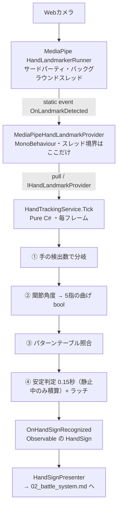
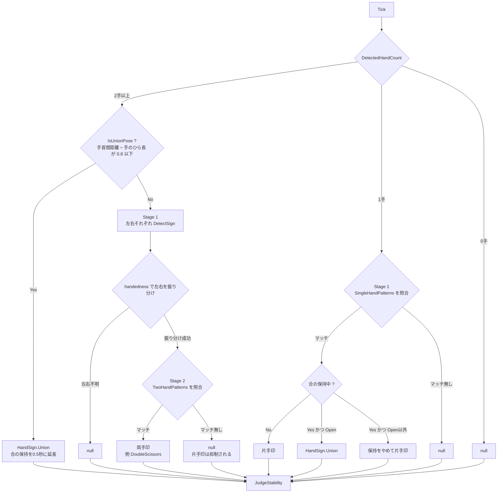
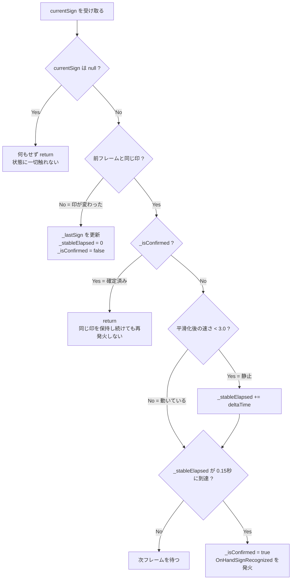

# ✋ 手印認識パイプライン

> **ドキュメント種別:** アーキテクチャ復習ドキュメント
> **対象:** `Assets/_MUDRA/Scripts/Input/`（namespace `MUDRA.HandTracking`）
> **関連:** [00_overview.md](00_overview.md) / [02_battle_system.md](02_battle_system.md)
> **仕様書:** §5 手印判定システム

このプロジェクトで最も密度が高い部分。カメラ映像から「確定した印」を1つ吐き出すまでを担う。

---

## 1. 全体の流れ



---

## 2. 入口の継ぎ目：MediaPipeプラグインへの改変

サードパーティのサンプルコードに**直接手を入れている**。

`Assets/MediaPipeUnity/Samples/Scenes/Hand Landmark Detection/HandLandmarkerRunner.cs`

```csharp
// :24
public static event Action<HandLandmarkerResult> OnLandmarkDetected;

// :162（推論結果が出るたびに呼ばれる箇所）
OnLandmarkDetected?.Invoke(result); // 追加
```

これがゲーム側への唯一の入口であり、**プロジェクト内で唯一の static 状態**でもある。

> **注意:** MediaPipeUnityPlugin を更新するとこの2行は消える。リポジトリ直下に `MediaPipeUnity.0.16.3.unitypackage` が置かれているが、再インポート時は必ずこの改変を入れ直すこと。P2 で「プラグイン改変は最小限・グルーは static event」と決めた経緯がある（dev_log_P2）。

`HandLandmarkerRunner` はシーン上の `Solution` GameObject に載っている。

---

## 3. MediaPipeHandLandmarkProvider

`Input/MediaPipeHandLandmarkProvider.cs` — この層で唯一の MonoBehaviour。

責務は3つだけ。

1. **static event の購読** — `OnEnable` / `OnDisable` で購読・解除
2. **スレッドの引き渡し** — コールバックはバックグラウンドスレッドで来るので、`UniTask.SwitchToMainThread()` を挟んでからキャッシュを書き換える

   ```csharp
   private void HandleLandmarkDetected(HandLandmarkerResult result)
       => UpdateCacheAsync(result).Forget();

   private async UniTaskVoid UpdateCacheAsync(HandLandmarkerResult result)
   {
       await UniTask.SwitchToMainThread();
       UpdateCache(result);
   }
   ```

   > **設計意図:** P2 では `volatile` フラグで凌いでいたが、A1 で UniTask に置き換えた。**スレッド越境をこのクラス1箇所に封じ込める**ことで、以降の層は同期的に読めるだけの世界になる。

3. **キャッシュ保持** — `List<HandLandmark>[2]`（各21点分を事前確保）+ handedness（左右）情報。3手目以降は捨てる。範囲外アクセスには `Array.Empty<HandLandmark>()` を返す（毎回 `new` しないための static フィールド）

### IHandLandmarkProvider

```csharp
IReadOnlyList<HandLandmark> GetLandmarks(int handIndex);  // 0: 1手目, 1: 2手目
int  DetectedHandCount { get; }
bool? IsLeftHand(int handIndex);                          // null = 未検出／判別不能
int  ResultVersion { get; }                               // 推論結果を受け取るたびに +1
```

`ResultVersion` は、判定側が「新しい推論結果が届いたか」を見分けるためのもの。`Tick` は描画フレームごと（100〜170回/秒）に呼ばれるが、推論結果の更新はそれより粗い（手が映っていると約25〜35回/秒）。手の速さのように推論間の差分を使う計算では、同じ古い結果を重ねて扱うと、0とスパイクが交互に出て使えない。

B2 で `GetCurrentLandmarks()`（1手専用）を廃止し `GetLandmarks(int)` に統一した。3手以上は想定外と割り切って、変更範囲が最小になる案を選んでいる（dev_log_B2 §3-1）。

このインターフェースがあるおかげで、将来 ルールベース判定 → PyTorch/ONNX/Sentis のモデル推論に差し替える余地が残されている（仕様書 §9-5）。

### HandLandmark

```csharp
public readonly struct HandLandmark
{
    public Vector3 Position { get; }  // MediaPipeの正規化座標（0.0〜1.0）のまま保持
    public int Index { get; }
}
```

**正規化座標のまま**扱うのが重要。ピクセル変換していないので、後述の比率判定が効く。

---

## 4. HandTrackingService（中核・約840行）

`Input/HandTrackingService.cs`。Pure C# / `IDisposable`。MonoBehaviour を継承しないのでテスト可能な形になっている（実際のテストはまだ無い）。

駆動は外部任せで、`HandSignPresenter.Update()` から毎フレーム `Tick(Time.deltaTime)` が呼ばれる。

### コンストラクタの既定値

```csharp
public HandTrackingService(
    IHandLandmarkProvider provider,
    float bentThreshold      = 45f,   // 人差し指〜小指の曲げ閾値（度）
    float thumbBentThreshold = 20f,   // 親指専用の閾値（度）
    float stableSeconds      = 0.15f) // 確定に必要な継続時間（秒・静止中のみ積算）
```

現状これらは全てハードコード。キャリブレーション機能（B6）でScriptableObject化する対象。

### Tick() の分岐



> **設計意図:** 2手検出中は**意図的に片手印を抑制する**。両手を写しているのに片方だけ拾って誤爆する、を防ぐため。結果として「手が2つ映っているが両手印ではない」状態は `null` になり、安定判定には届かない。

### 手の速さと静止判定（`UpdateHandSpeed`）

`ResultVersion` が変わったとき（＝新しい推論結果が届いたとき）だけ、手の速さを更新する。

- **計測点**：手首と5本の指先（ランドマーク 0, 4, 8, 12, 16, 20）。手全体の移動と、指の曲げ伸ばしの両方を拾える
- **速さ**：前回の推論からの計測点の最大移動量 ÷ 手のひら長（手首〜中指の付け根）÷ 経過秒。単位は「手のひら長/秒」で、カメラとの距離に左右されない
- **2手のとき**：前回の位置は左右の区分ごとに保持し、速いほうを採用する
- **平滑化**：推論1回ごとの値は、保持中でも最大2.5程度まで跳ねる。そのため指数移動平均（時定数 `SpeedSmoothingSeconds` = 0.1秒）でならした `_smoothedHandSpeed` を使う。重みは `1 - exp(-経過秒 / 0.1)` で、推論間隔が揺れても時間あたりのならし具合は一定
- **新しく現れた手**：前回の位置がなく速さを測れないので、「動いている」扱い（閾値と同じ値）から始める。手を上げてきた直後に、止まる前に確定するのを防ぐため

平滑化後の速さが `StillSpeedThreshold`（3.0）**未満**のときだけ、安定判定の時間を進める（§7）。

> **設計意図:** 確定時間を短くするだけだと、印を組み替える途中の中間の形が確定してしまう。実測では、Cancel → Release の途中で Cancel が0.15秒続いた例があった。中間の形は手が動いている最中に現れるので、「止まっている間だけ時間を数える」ことで、確定時間を縮めても誤確定しにくくした。閾値3.0は実測（保持中の平均 約0.7、組み替え中の平均 2〜8・最大 16〜39、途中で一瞬成立した Cancel 3.6〜4.9）から決めた出発点の値。

---

## 5. Stage 1：片手の判定

### 指の曲げ判定（`IsFingerBent`）

3点のなす角が閾値を超えていたら「曲がっている」。

| 指 | 使うランドマーク | 閾値 |
|---|---|---|
| 人差し指 | MCP(5) - PIP(6) - DIP(7) | 45° |
| 中指 | MCP(9) - PIP(10) - DIP(11) | 45° |
| 薬指 | MCP(13) - PIP(14) - DIP(15) | 45° |
| 小指 | MCP(17) - PIP(18) - DIP(19) | 45° |
| **親指** | **CMC(1) - MCP(2) - IP(3)** | **20°** |

```csharp
var vectorA = pip - mcp;
var vectorB = dip - pip;
var angle   = Vector3.Angle(vectorA, vectorB);
// 前回の状態に応じて切り替え点をずらす（ヒステリシス）
var effectiveThreshold = previous switch
{
    true  => threshold - hysteresis,  // 曲げ中は 閾値-余裕 を下回るまで曲げのまま
    false => threshold + hysteresis,  // 伸び中は 閾値+余裕 を上回るまで伸びのまま
    null  => threshold,               // 履歴なし
};
return angle > effectiveThreshold;
```

**ヒステリシス**：角度が閾値付近で揺れると、曲げと伸びがフレームごとに入れ替わり、印の候補が途切れる。これを防ぐため、指ごとの前回の状態（`_prevBent[手の区分, 指]`）に応じて切り替え点をずらす。余裕は親指が3°（`ThumbHysteresisDegrees`）、他の4指が5°（`FingerHysteresisDegrees`）。手の区分は左・右・左右不明の3つ。2手検出時に MediaPipe が返す手の順番が入れ替わっても状態が混ざらないよう、配列の添字ではなく handedness で分けている。その Tick で判定しなかった区分の履歴は破棄する。

> **設計意図:** 親指は関節構造が他4指と違い可動域が狭く、45°では一度も「曲がっている」と判定されない。A3 で `ThumbAngleDebugger` を使って実測したところ **Open時 約10° / Fist時 約26° / Palm時 約38°** だったため、閾値20°を採用した（dev_log_A3 §3-1）。マージンは Open 側が10°、**Fist 側は6°しかない**。親指のヒステリシスを3°と狭くしているのはこのため。P2〜A1 の間、親指は判定から除外されていた。

### パターンテーブル（`SingleHandPatterns`）

5指の曲げ状態（O = 伸び / X = 曲げ）の組み合わせで印を決める。**上から順に照合し、最初にマッチしたものを返す**（＝配列順がそのまま優先度）。

| 印 | 親指 | 人差し | 中 | 薬 | 小 | 種別 |
|---|---|---|---|---|---|---|
| `Open`（開） | O | O | O | O | O | 詠唱印 |
| `Fist`（握） | X | X | X | X | X | 詠唱印 |
| `Guard`（盾） | O | X | X | X | X | 特殊（ガード） |
| `Point`（指） | X | O | X | X | X | 詠唱印 |
| `Scissors`（刃） | X | O | O | X | X | 詠唱印 |
| `Palm`（掌） | X | O | O | O | O | 詠唱印 |
| `Release`（射） | X | O | X | X | O | 特殊（発動） |
| `Cancel`（散） | X | X | X | X | O | 特殊（解除） |

`SingleHandPattern` の各指は `bool?` 型で、`null` はワイルドカード（どちらでもマッチ）。現行8パターンでは未使用だが、「親指はどちらでも良い」のような緩い定義に将来対応できる。

> **設計意図:** B2 Step 3 で `if` の羅列からテーブル駆動に全面リファクタした。**新しい印の追加が配列への1行追加で完結する**ことが狙い（dev_log_B2 §2 Step3）。

---

## 6. Stage 2：両手の判定

### 合掌（Union）判定 — 別枠の専用ロジック

`IsUnionPose()` は指の形を見ない。**両手の手首がどれだけ近いか**だけを見る。

```csharp
palmLength    = |landmark[0] - landmark[9]|            // 1手目の手のひら長（手首→中指付け根）
wristDistance = |hand0[0] - hand1[0]|                  // 両手の手首間距離
return wristDistance / palmLength <= 0.8f;             // UnionWristDistanceRatio
```

> **設計意図:** MediaPipe の座標は**画面に対する正規化座標**なので、カメラに近づくと手が大きく映り、すべての距離が伸びる。生の距離で閾値を切るとカメラ距離依存になってしまう。そこで**手のひら長をスケール基準にした比率**で判定し、距離非依存にしている（dev_log_B2 §3）。閾値 `0.8f` は実機調整前の仮値で、β版でScriptableObject化する候補。

### 合の保持（`ApplyUnionHold`）

**問題：** 手のひらを合わせて止めると、MediaPipe は重なった手を「開いた片手」として1本だけ検出しがちになる（実測で 1本 68〜89%、2本 11%）。そのままだと止まった状態で Open が確定してしまい、Union は2本が見える一瞬しか候補にならないので確定できない。

**仕組み：** 2手検出で `IsUnionPose` が true になるたびに、`_unionHoldRemaining` を `UnionHoldSeconds`（0.5秒）に延長する。保持中に1手しか検出されなかった場合は、片手判定の結果を次のように扱う。

| 片手判定の結果 | 扱い |
|---|---|
| Open | Union とみなす |
| Open 以外の印 | 保持をすぐやめ、その印を使う（合のあと別の印へ移るときに待たせないため） |
| null | そのまま null |

0.5秒は、合わせている間の2本検出が1秒に2〜3回（間隔は平均0.4秒前後）だったことから、それを少し上回る値にした出発点の値。

**静止判定との兼ね合い：** 合わせている間は2本目の手が出たり消えたりし、1本時の左右判定も入れ替わる。そのたびに「新しく現れた手」として速さを3.0に引き上げると、Union の確定時間が進まない。そこで**保持中はこの引き上げを行わない**。保持は2本が合わさってから始まるので、手を上げてきた直後の対策（§4「手の速さと静止判定」）はそのまま効く。

**副作用：** 合を確定したあと、手を離してすぐ片手で Open を組むと、最後に2本が見えてから最大0.5秒は Union とみなされる。Open 以外の印はすぐに切り替わる。

### 10本指パターン（`TwoHandPatterns`）

Stage 1 で左右それぞれ片手判定した結果を組み合わせる。左右の振り分けには MediaPipe の handedness（`IsLeftHand`）を使い、**不明なら判定を諦めて `null`**。

```csharp
new TwoHandPattern(HandSign.Scissors, HandSign.Scissors, HandSign.DoubleScissors),
```

現在**この1行だけ**。`TwoHandPattern` の左右も `bool?` ならぬ `HandSign?` のワイルドカード対応済みなので、「左は何でもいい」も書ける。ここが今後の両手印の拡張ポイント。

---

## 7. 安定判定とラッチ（`JudgeStability`）

認識結果のチラつきを吸収して「確定」に変える最後の関門。



ポイントは3つ。

**① null を「何もしない」扱いにしている**
「手が映っていない」「どのパターンにも一致しない」「両手検出中で片手印を抑制した」は全て `null` として届く。ここでカウンタをリセットしてしまうと、認識が1フレーム途切れただけで積み上げが台無しになる。**状態に触れずに早期returnする**ことで、手が一瞬消えても直前の確定状態を保ったまま継続できる（dev_log_P3 の設計判断をそのまま継承）。

**② `_isConfirmed` によるラッチ**
一度確定した印は、**別の印に変わるまで二度と発火しない**。これが無いと確定時間を過ぎたあとも毎フレーム発火して、印を1つ組んだだけでシーケンスが詰まる。

**③ 静止している間だけ時間を数える**
手が動いている間（平滑化後の速さが3.0以上）は、候補の印が続いていても時間を進めない（§4「手の速さ」）。候補の切り替え自体は速さに関係なく行う。

確定時間は **秒** で数える（`deltaTime` の積算）。以前は描画フレーム数（36）で数えていたため、FPS によって確定時間が変わっていた（約160fps で0.23秒、60fps なら0.6秒）。既定値の0.15秒は、静止判定で組み替え途中の形を除いたうえで、変更前の0.23秒から短くした値。静止を待つ時間があるので、候補になってから確定するまでの実時間はこれより長くなる。仕様書 §5-2 Step 3 も v1.7（B4.5）でこの方式に合わせた。

調整用に、判定の経過（候補切替・確定・合の保持）をログに出せる。`HandSignPresenter` の `Log Hand Sign Judgement` をオンにすると `[HandSign]` で始まるログが出る（既定はオフ。`#if UNITY_EDITOR || DEVELOPMENT_BUILD`）。閾値の調整手順は [hand_sign_tuning.md](../hand_sign_tuning.md)。

出力は R3 の `Subject<HandSign>`：

```csharp
public Observable<HandSign> OnHandSignRecognized => _onHandSignRecognized;
```

---

## 8. HandSign 一覧

`Input/HandSignEnum.cs`。**グローバル名前空間**に置かれている点に注意。

| 値 | 名前 | 和名 | 形 | 用途 |
|---|---|---|---|---|
| 0 | `Open` | 壱印「開」 | パー（全指伸び） | 詠唱印 |
| 1 | `Fist` | 弐印「握」 | グー（全指曲げ） | 詠唱印 |
| 2 | `Point` | 参印「指」 | 人差し指のみ伸ばす | 詠唱印 |
| 3 | `Release` | 発動印「射」 | 人差し指 + 小指を伸ばす | **特殊** — シーケンスを発動 |
| 4 | `Cancel` | 解除印「散」 | 小指のみ伸ばす | **特殊** — シーケンスをリセット |
| 5 | `Scissors` | 肆印「刃」 | チョキ | 詠唱印 |
| 6 | `Palm` | 伍印「掌」 | 親指だけ折る | 詠唱印 |
| 7 | `Guard` | 捌印「盾」 | 親指のみ伸ばす | **特殊** — ガード受付窓を開く |
| 8 | `Union` | 陸印「合」 | 両手を合わせる | 両手印・詠唱印 |
| 9 | `DoubleScissors` | 「刃」二つ | 両手チョキ | 両手印・詠唱印 |

`Release` / `Cancel` / `Guard` に**意味を与えるのは `HandTrackingService` ではない**。ここは「どの形か」を返すだけで、それが発動なのか解除なのかの解釈は `HandSignPresenter.HandleSignConfirmed()` が行う（仕様書 §5-3）。

> **重要:** 値は `SpellData.sequence` に**シリアライズ済み**。既存値の変更・並べ替えは全アセットを壊す。追加は必ず末尾に。

---

## 9. デバッグ／検証用スクリプト

| スクリプト | 役割 | 状態 |
|---|---|---|
| `Debug/DebugKeyboardInput.cs` | キーボードで `HandSign` を直接発火。カメラ無しで全機能テスト（B1） | シーンに存在するが `HandSignPresenter` 側が**未割り当て**＝無効 |
| `Debug/DebugMenuView.cs` | F1でOnGUIオーバーレイ。HP操作・StatusEffect付与・無敵・FPS（B1） | 有効 |
| `Debug/ThumbAngleDebugger.cs` | 親指の角度を実測ログ出力。A3の閾値20°はこれで決めた | シーン未配置（役目を終えた一時スクリプト） |
| `Input/HandTracking/TempHandTrackingRunner.cs` | A1以前の旧ドライバ。**自前で `HandTrackingService` を生成**して `Debug.Log` するだけ | シーンに存在するがコンポーネント無効（B4.5） |
| `Debug/HandTrackingActiveTest.cs` | 毎フレーム検出手数をログ出力。クラス名は `Test`（ファイル名と不一致） | シーンに存在するがコンポーネント無効（B4.5） |
| `HandSignPresenter` の `Log Hand Sign Judgement` | 判定の経過を `[HandSign]` ログに出す（§7）。閾値の調整用 | 既定オフ |

---

## 10. 気をつける点

現コードを読んだ上での事実メモ。バグ報告ではなく、読むときに混乱しないための注記。

- **`TempHandTrackingRunner` と `HandTrackingActiveTest` は InGame.unity に残っているが、B4.5 でコンポーネントを無効にした。** 前者を有効にすると、`HandSignPresenter` とは**別の `HandTrackingService` インスタンス**が毎フレーム `Tick()` され、認識処理が二重に走る。スクリプトを消すかは未定
- **`FingerState` 構造体はどこからも参照されていない。** 角度も返す設計だったが、現在の `IsFingerBent` は `bool` を直接返している
- `HandSignPresenter` のシーン上の `m_EditorClassIdentifier` が `SpellSequenceRunner` のまま（B1のリネーム前の名残）。動作には影響しない
- **合の保持は Open だけを対象にした限定対応。** 合わせた手が別の形（Palm など）に見える例が出たら見直す
- **合わせた両手が1本の手として検出されることが多い。** 横向きで重なった手のひらは MediaPipe の苦手な条件で、重なった2つの検出候補が1つにまとめられる（手のひら検出の重複除去）。信頼度の設定では直らない。合の保持（§6）で一部を吸収しているが、2本が全く見えないと Union にならない。B4.5 では解消を見送った
- **MediaPipe の設定ウィンドウ（`Main Canvas/Footer` のボタン）は B4.5 で使えるようにした。** `Body` の透明な Image がフッターを覆っていたため Raycast Target をオフにし、`Modal Panel` を起動時は非アクティブにした。ウィンドウで変えた値は実行中だけ有効で、開いている間は推論が止まる
