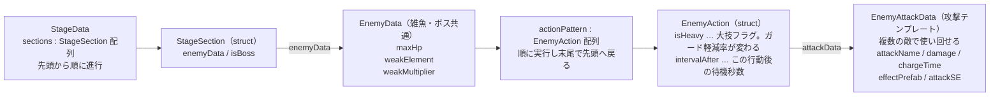
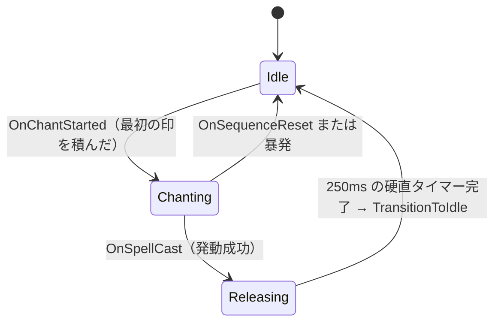
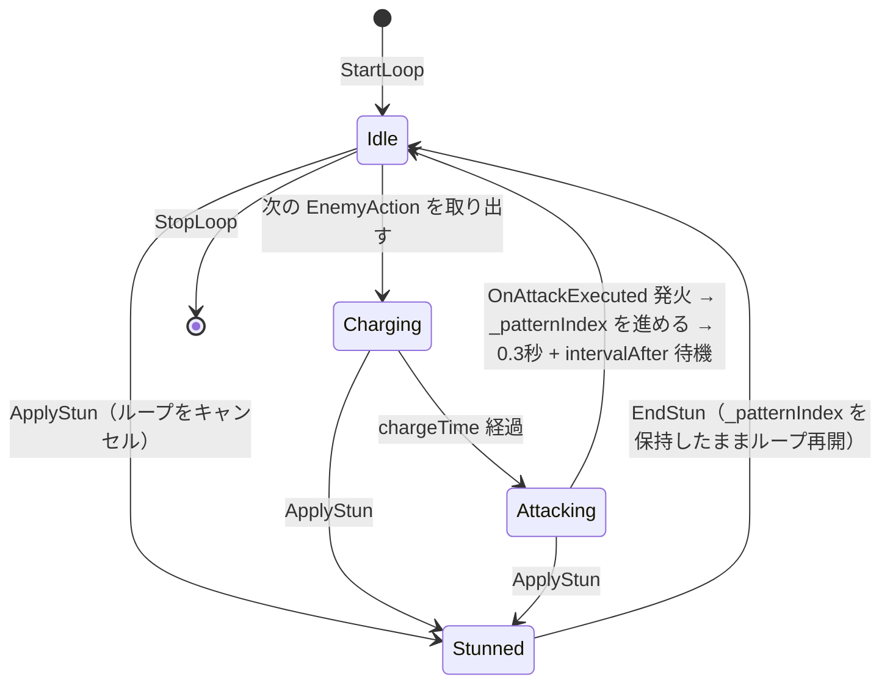
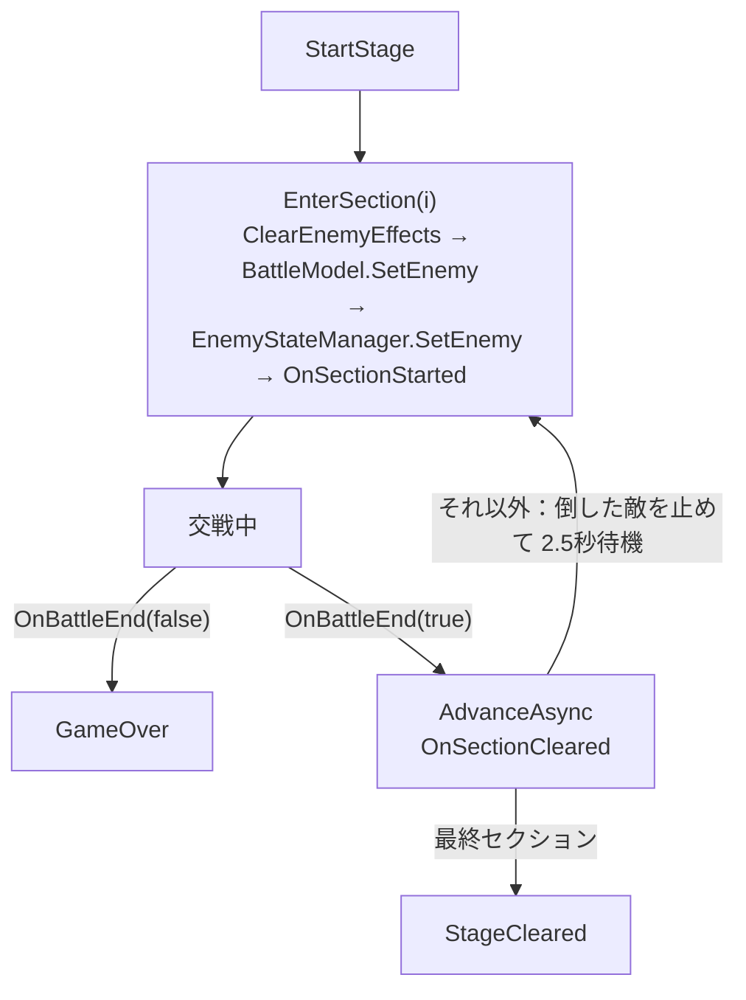

# ⚔️ バトルシステム

> **ドキュメント種別:** アーキテクチャ復習ドキュメント
> **対象:** `Scripts/Data/` `Scripts/Model/` `Scripts/Presenter/` `Scripts/View/`
> **関連:** [00_overview.md](00_overview.md) / [01_hand_input.md](01_hand_input.md)
> **仕様書:** §6 シーケンス管理 / §7 バトルシステム / §8 MVP構成

確定した印を受け取ってから、ダメージが出てHPバーが減るまで。

---

## 1. Data層 — ScriptableObject

`Scripts/Data/`。全レイヤーから参照される純粋なデータ。`SpellData` と `SpellEnums` は `namespace MUDRA.Data`、`EnemyData` 系はグローバル名前空間。

### SpellData（`Create > MUDRA > SpellData`）

| フィールド | 用途 | 使用状況 |
|---|---|---|
| `spellName` | 表示名。テロップに出る | ✅ |
| `element` | `ElementType`。敵の弱点との相性計算 | ✅ |
| `sequence` | `HandSign[]`。**発動印は含めない** | ✅ |
| `basePower` | 基礎威力。全Strategyの起点 | ✅ |
| `damageType` | `DamageType`。Strategyの選択に使う | ✅ |
| `hitCount` | MultiHit時のヒット数 | ✅ |
| `statusEffect` / `statusEffectDuration` | 副次効果の種類と持続秒数 | ✅ |
| `rangeType` | `AttackRangeType` | ⚠️ 未使用 |
| `icon` / `description` | 図鑑用 | ⚠️ 未使用 |
| `cutInSprite` | カットインの帯に載せる絵 | ✅（B4。未設定なら帯と術名だけ） |
| `effectPrefab` | 術ごとのエフェクト | ✅（B4。未設定なら `SpellEffectView` の既定エフェクト） |
| `effectOnCaster` | エフェクトを術者側に出すか（回復術で true） | ✅（B4） |
| `castSE` | 発動時のSE | ⚠️ 未使用（B7で接続） |

### EnemyData / EnemyAttackData / EnemyAction



雑魚とボスに構造上の差は無く、`EnemyData` のパラメータで差をつける。`isBoss` は演出（背景切替・ボス戦専用演出）、1手目までの待機（ボスは長い）、デバッグメニューの「ボスへ飛ぶ」で使う。

### enum（`Data/SpellEnums.cs`）

| enum | 値 |
|---|---|
| `ElementType` | Wind, Earth, Thunder, Water, Fire, Light |
| `AttackRangeType` | Single, Area |
| `StatusEffectType` | None, Slow, Stun, DamageOverTime（**Slow は実装クラス無し**） |
| `DamageType` | SingleHit, MultiHit, DamageOverTime |

---

## 2. SpellSequenceModel — 印の積み上げと発動判定

`Model/SpellSequenceModel.cs`。Pure C# / `IDisposable`。

### 保持するもの

```csharp
List<SpellData> _allSpells;        // 全術（不変）
List<HandSign>  _inputHistory;     // 積んだ印
List<SpellData> _matchCandidates;  // 前方一致で生き残っている候補
float           _chantStartTime;   // 詠唱開始時刻（速度ボーナス用）
```

### 3つの入口

| メソッド | 動作 |
|---|---|
| `AddSign(sign)` | 履歴に積む。**空→非空の瞬間に詠唱開始時刻を記録**し `OnChantStarted` 発火。`_matchCandidates` を「i番目の印が一致する術」だけに絞り込み、その後 `OnSignAdded` 発火 |
| `Release()` | 候補のうち **`sequence.Length == _inputHistory.Count`** のものを探す。見つかれば成功、無ければ暴発。どちらも `SpellCastResult` として `OnSpellCast` に流す |
| `Cancel()` | 履歴と候補をリセットし `OnSequenceReset(SequenceResetReason.Cancel)` |

> **設計意図:** 候補の絞り込みは**前方一致の逐次フィルタ**。1印積むたびに候補が減るので、`SequenceGuideView` は「今この印まで組むとどの術が狙えるか」をそのまま表示できる。

### 速度ボーナス

```csharp
threshold = 印数 × 1.0秒          // SpeedBonusTimePerSign
詠唱時間 <= threshold  →  ×1.5    // SpeedBonusMultiplier
それ以外                →  ×1.0
```

時刻取得は `Func<float> getTime` としてコンストラクタに注入される（`BattleInitializer` が `() => Time.time` を渡す）。**テスト時に偽の時計を差せるようにするため**の意図的な設計（A4）。

### SpellCastResult

```csharp
public readonly struct SpellCastResult
{
    public readonly bool      IsSuccess;   // false = 暴発
    public readonly SpellData Spell;       // 暴発時は null
    public readonly float     SpeedBonus;  // 暴発時は 1.0 固定
}
```

> **設計意図:** 成功と暴発を**別イベントに分けず1つの型に統合**している。購読側が「成功のとき」「暴発のとき」を `Where` で振り分ければよく、イベントの数が増えない。コンボ数を持たないのは、`SpellSequenceModel` にコンボ状態を知らせない設計を保つため（コンボは `BattleModel` の持ち物）。

### 4つの出力ストリーム

| ストリーム | 発火タイミング | 主な購読者 |
|---|---|---|
| `OnChantStarted` | 最初の印を積んだとき | `PlayerStateManager`（Idle→Chanting） |
| `OnSignAdded` | 印を積んで候補を絞った後 | `SequenceGuideView` |
| `OnSpellCast` | `Release()` 時（成功・暴発とも） | `BattleModel` / 各View / `PlayerStateManager` |
| `OnSequenceReset` | `Cancel()` 時 | ガイドクリア / `PlayerStateManager` |

---

## 3. BattleModel — HP・コンボ・勝敗

`Model/BattleModel.cs`。バトル全体の数値の持ち主。

### 公開している状態（R3）

```csharp
ReadOnlyReactiveProperty<int>  PlayerHp / BossHp   // 内部は ReactiveProperty
ReadOnlyReactiveProperty<int>  ComboCount
ReadOnlyReactiveProperty<bool> IsBattleActive
Observable<bool>               OnBattleEnd         // 現在の敵1体との決着。true = 撃破
Observable<EnemyData>          OnEnemyChanged      // SetEnemy で敵が差し替わった（HPバー再初期化用）
// --- 演出用の出来事通知（B4）。HPを書き換えた直後・CheckBattleEndの前に発火（トドメでも演出が出る） ---
Observable<DamageResult>       OnSpellHit          // 術の命中（回復術も流れる。TotalDamage=0）
Observable<int>                OnDotTick           // DoTのtickダメージ
Observable<PlayerDamageInfo>   OnPlayerDamaged     // 被弾（敵の攻撃・暴発）。量・ガード有無・大技か・暴発か。無敵中は流れない
Observable<int>                OnHealed            // 実回復量（満タンで0なら流れない）
int PlayerMaxHp                                    // 不変
int BossMaxHp                                      // SetEnemy で変わる
```

### 敵の差し替え

`SetEnemy(enemyData)` は `SectionProgressManager` から呼ばれ、敵データ・BossHp・BossMaxHp を差し替えて `_isBattleActive` を true に戻す。**プレイヤーHPとコンボには触らない**（セクション間の引き継ぎ）。`BattleModel` 自身はセクションの概念を持たない。

### ダメージ・回復の5経路

| メソッド | 呼び出し元 | 内容 |
|---|---|---|
| `ApplySpellDamage(result)` | `BattlePresenter`（`OnSpellCast` 購読） | 成功: Strategyで計算 → ボスHP減 → コンボ++ → 副次効果付与 ／ 暴発: `ApplyMisfireDamage` へ |
| `ApplyDotDamage(damage)` | `DotEffect` から `Action` 経由で毎秒 | ボスHPのみ減らす。**コンボ・速度倍率は乗せない**（初撃のみ適用の方針） |
| `ApplyEnemyDamage(action, isGuarding)` | `BattlePresenter`（`OnAttackExecuted` 購読） | ガード中なら軽減率を掛けてプレイヤーHP減 |
| `ApplyMisfireDamage()`（private） | 上記から | **MaxHPの5%**のセルフダメージ + コンボリセット |
| `ApplyHeal(amount)` | `HotEffect` から `Action` 経由で毎秒 | プレイヤーHPを MaxHP 上限で回復。勝敗に関与しないので `CheckBattleEnd` は呼ばない |

### 定数

| 定数 | 値 | 意味 |
|---|---|---|
| `NormalGuardRate` | 0.5 | 通常攻撃をガードしたときのダメージ倍率 |
| `HeavyGuardRate` | 0.3 | 大技（`isHeavy`）をガードしたときの倍率 |
| `MisfireDamageRate` | 0.05 | 暴発セルフダメージ（MaxHP比） |

回復以外のすべての経路が最後に `CheckBattleEnd()` を通り、どちらかのHPが0になった時点で `_isBattleActive = false` にして `OnBattleEnd` を1回だけ流す。

### 2段階初期化

```csharp
var battleModel = new BattleModel(playerMaxHp, enemyData);
var factory = new StatusEffectFactory(
    battleModel.ApplyDotDamage,      // Action<int>
    enemyStateManager.ApplyStun,     // Action
    enemyStateManager.EndStun,       // Action
    battleModel.ApplyHeal);          // Action<int>
battleModel.SetStatusEffectDependencies(statusEffectManager, factory);
```

> **設計意図:** コンストラクタで渡そうとすると `BattleModel` と `EnemyStateManager` が互いを必要として循環する。`Action` デリゲートで受け渡し、生成後に1回だけ注入することで、**Model同士がクラス参照を持たない**状態を保っている（A5）。

### デバッグ専用メンバ

`#if UNITY_EDITOR || DEVELOPMENT_BUILD` で囲われた `IsInvincible` / `DebugModifyPlayerHp` / `DebugModifyBossHp` / `DebugResetPlayerState`（ステージジャンプ用。HP全回復・コンボ0）。`DebugMenuView` から操作する。無敵中でも**暴発のコンボリセットだけは発生する**（ダメージだけ無効化）。

---

## 4. ダメージ計算 Strategy

`Model/Strategy/`。`SpellData.damageType` で実装を選ぶ（`BattleModel.ResolveCalculator`）。

```csharp
public interface IDamageCalculator
{
    DamageResult Calculate(SpellData spellData, EnemyData enemyData, float speedBonus, int comboCount);
}
```

### 共通倍率

| 倍率 | 式 |
|---|---|
| 弱点 | `spellData.element == enemyData.weakElement` なら `weakMultiplier`（ClayDollは 1.5）、でなければ 1.0 |
| 速度ボーナス | 1.5 または 1.0（`SpellSequenceModel` が算出済み） |
| コンボ | `1.0 + comboCount × 0.1` |

### 3つの実装

| Strategy | 式 |
|---|---|
| `SingleHitCalculator` | `basePower × 弱点 × 速度 × コンボ` |
| `MultiHitCalculator` | 1ヒット = `basePower ÷ hitCount × 弱点 × 速度 × コンボ`、合計 = 1ヒット × `hitCount` |
| `DamageOverTimeCalculator` | 初撃 = `basePower × 0.3 × 弱点 × 速度 × コンボ`<br>tick1回 = `basePower × 0.7 ÷ tick数 × 弱点`（tick数 = `statusEffectDuration ÷ 1.0秒`） |

> **MultiHitの端数について:** 1ヒットをintに丸めてから掛けるため、同じ `basePower` の SingleHit より合計が微妙に低くなる。**仕様として許容**するとコード中に明記されている。

`DamageResult` は public field を持つ mutable struct。`TotalDamage` / `PerHitDamage` / `HitCount` / `IsWeakness` / `HasSpeedBonus` / `AppliedEffect` / `EffectDuration` / `PerTickDamage` / `TickCount`。`PerHitDamage` と `HitCount` は `DamageNumberView` の MultiHit 時間差表示で使う（B4）。

---

## 5. StatusEffect — 時限効果

`Model/StatusEffect/`。

```csharp
public interface IStatusEffect
{
    StatusEffectType Type { get; }
    bool IsExpired { get; }
    void OnApply();              // 開始時1回
    void OnTick(float deltaTime); // 毎フレーム
    void OnExpire();             // 終了時1回
}
```

| クラス | 役割 |
|---|---|
| `StatusEffectManager` | 付与・解除を `OnEffectApplied` / `OnEffectRemoved` で通知する（解除は期限切れ・`ClearEnemyEffects`・`ClearAll` の全経路。状態アイコン用・B4）。アクティブな効果をListで保持。`BattlePresenter.Update()` から `Tick(deltaTime)`。**同種の効果は重複不可**（既に同じ `Type` があれば無視）。セクション遷移時は `ClearEnemyEffects()`（HoT以外を除去）、ステージ決着時は `ClearAll()` |
| `StatusEffectFactory` | `DamageResult.AppliedEffect` を見て `DotEffect` / `StunEffect` / `HotEffect` を生成。`None` なら null。生成に必要な処理は全て `Action` で受け取っており、**BattleModel / EnemyStateManager への参照を持たない** |
| `DotEffect` | 残り時間を減らしつつ、1.0秒 tick ごとに `_applyDamage(perTickDamage)` を呼ぶ。初撃は `BattleModel` 側で処理済みなので、ここは tick のスケジュール管理のみ |
| `StunEffect` | `OnApply` で `EnemyStateManager.ApplyStun()`、`OnExpire` で `EndStun()`。時間管理は `OnTick` |
| `HotEffect` | `DotEffect` と同形で、1.0秒 tick ごとに `ApplyHeal` を呼ぶ。**唯一プレイヤーに付く効果**で、セクション遷移で消えない。回復量 `PerTickHeal` は Strategy ではなく `BattleModel` が `SpellData.healPower ÷ tick数` で埋める（弱点・コンボ倍率を回復に乗せないため） |

### GuardWindowManager

`IStatusEffect` ではなく単体のクラス。`BattlePresenter.Update()` から `Tick(deltaTime)` で駆動。

```csharp
Activate()                              // Guard印確定時に呼ぶ。受付窓を開く
ReadOnlyReactiveProperty<bool> IsGuarding  // 残り時間 > 0。開閉の2回だけ通知（構え枠の表示用・B4）
private const float WindowDuration = 1f;
```

> **設計意図:** A5 で「構え続けるガード」から**タイミングガード**に方針転換した。`PlayerPhase` から独立させているので、**詠唱中でもガードできる**。`PlayerPhase` に `Guarding` を追加しなかったのはこのため（仕様書 §4-2）。


---

## 6. 状態管理

### プレイヤー：Stateパターン

`Model/PlayerStateManager.cs` + `Model/State/`。



`IPlayerState { Phase, Enter(), Exit() }` を `IdleState` / `ChantingState` / `ReleasingState` が実装。前2つは中身が空のシェル。`ReleasingState` だけが実処理を持ち、`Enter()` で 250ms（`RecoveryDurationMs`）の UniTask タイマーを回し、完了したら `PlayerStateManager.TransitionToIdle()` を呼ぶ。`Exit()` で CTS をキャンセルするので、硬直中に別状態へ飛んでもタイマーが暴発しない。

遷移の入口 `HandleChantStarted` / `HandleSpellCast` / `HandleSequenceReset` は**自分で購読せず、`HandSignPresenter` から呼ばれる**。フェーズは `ReadOnlyReactiveProperty<PlayerPhase> CurrentPhase` で公開。

### 敵：enum + UniTaskループ

`Model/EnemyStateManager.cs`。**あえて Stateパターンを使っていない**（仕様書 §2 に明記）。



| メソッド | 動作 |
|---|---|
| `StartLoop(firstActionDelay)` | 既存ループを止めてから `_patternIndex = 0` で開始。1手目の Charging の前に `firstActionDelay` 秒待つ（登場演出と予告を重ねないため・B4）。`actionPattern` 未設定なら `LogError` |
| `StopLoop()` | CTSキャンセル + Idleへ。ステージ決着・シーン破棄時 |
| `SetEnemy(enemyData, firstActionDelay)` | `StopLoop` → 敵データ差し替え → `StartLoop`。待機時間は `SectionProgressManager` が決める（雑魚1.0秒・ボス3.0秒）。セクション遷移で使う。インスタンスを作り直さないので購読と `StatusEffectFactory` のデリゲートが生きたまま残る |
| `ApplyStun()` | ループを止めて `Stunned` へ。**`_patternIndex` は保持する** |
| `EndStun()` | Idle に戻して**中断された位置からループ再開** |

`OperationCanceledException` はキャンセル＝正常終了として握り潰す。

---

## 7. Presenter — 配線一覧

ロジックは書かない。「誰のどのストリームを購読して、誰の何を呼ぶか」だけ。

### HandSignPresenter

`Update()` で `HandTrackingService.Tick()` を回す。ただし `_debugKeyboardInput` が割り当てられている場合は **Tick を回さず**、キーボード入力を直接 `HandleSignConfirmed` に流す（`#if UNITY_EDITOR || DEVELOPMENT_BUILD`）。

**印の意味づけはここで行われる。**

```csharp
private void HandleSignConfirmed(HandSign sign)
{
    switch (sign)
    {
        case HandSign.Release: _model.Release(); break;
        case HandSign.Cancel:  _model.Cancel();  break;
        case HandSign.Guard:   _guardWindowManager.Activate(); break;
        default:               _model.AddSign(sign); break;   // 詠唱印
    }
}
```

| 購読するストリーム | 呼ぶもの |
|---|---|
| `HandTrackingService.OnHandSignRecognized` | `HandleSignConfirmed`（上記）/ デバッグテキスト更新 |
| `SpellSequenceModel.OnSignAdded` | `SequenceGuideView.UpdateGuide(MatchCandidates, InputCount)` + `PlayConfirmEffect()` |
| `OnSpellCast` | ガイド `Clear()` → 成功なら `SpellEffectView.PlaySpellEffect(effectPrefab, effectOnCaster)` + `SpellTelopView.ShowCutIn(spellName, element, cutInSprite)`、暴発なら `ShowMisfire()` |
| `OnSpellCast`（成功のみ） | `PlayerStateManager.HandleSpellCast()` |
| `OnSpellCast`（暴発のみ） / `OnSequenceReset` | `PlayerStateManager.HandleSequenceReset()` |
| `OnChantStarted` | `PlayerStateManager.HandleChantStarted()` |

### BattlePresenter

`Update()` で `StatusEffectManager.Tick()` と `GuardWindowManager.Tick()` を回す。

| 購読するストリーム | 呼ぶもの |
|---|---|
| `BattleModel.PlayerHp` / `BossHp`（`.Skip(1)`） | `HpBarView.SetHp(hp, maxHp)` ※初期表示は `InitializeHp` で別途 |
| `BattleModel.OnEnemyChanged` | ボスHPバーを `InitializeHp` で新しい敵の MaxHp に合わせ直す |
| `BattleModel.ComboCount` | `ComboView.SetCombo` |
| `BattleModel.OnSpellHit`（`TotalDamage > 0` のみ）/ `OnDotTick` / `OnHealed` | `DamageNumberView` |
| `BattleModel.OnPlayerDamaged` | 数字 ＋ 暴発 / ガード成功 / 被弾（大技か）でフラッシュ・揺れ・「防」を出し分け |
| `GuardWindowManager.IsGuarding` | `GuardView.SetStance`（構え枠） |
| `StatusEffectManager.OnEffectApplied` / `OnEffectRemoved` | `StatusIconView.SetEffectActive` |
| `EnemyStateManager.OnAttackExecuted` | `BattleModel.ApplyEnemyDamage(action, guardWindow.IsGuarding)` ＋ 敵の攻撃エフェクト |
| `SpellSequenceModel.OnSpellCast` | `BattleModel.ApplySpellDamage(result)` |
| `SpellSequenceModel.OnSequenceReset` | `Debug.Log`（UI演出フックの予定地） |

`.Skip(1)` は `ReactiveProperty` が購読時に現在値を流すため、初期値での余計なアニメーションを避ける目的。

B4で増えた View（フラッシュ・揺れ・ガード・数字・コンボ・アイコン）は `Initialize` の引数ではなく `[SerializeField]` で受け取る（引数を増やし続けないため。`HandSignPresenter` と同じやり方）。

### EnemyPresenter（B4）

ステージ進行に沿った表示を配線する。**表示専用で Model を操作しない**（ダメージ適用は `BattlePresenter` に残す）。

| 購読するストリーム | 呼ぶもの |
|---|---|
| `SectionProgressManager.OnStageStarted` | `StageTitleView.ShowStageTitle` |
| `OnSectionStarted` | `BattleResultView.Hide` → `BackgroundView.SetBackground`（`isBoss` で道中/ボス）→ `EnemyView.Appear`。ボスなら登場シーケンス（`BossEncounterView.PlayEncounter` / `CameraShakeView.ShakeBossRoar` / `StageTitleView.ShowBossTitle`） |
| `OnSectionCleared` | ボスならヒットストップ・白フラッシュ・大揺れ・`PlayBossDefeat`、雑魚なら `PlayDefeat`。次があれば `BackgroundView.PlayAdvance` |
| `OnStageCleared` / `OnGameOver` | `BattleResultView`（ボス撃破時は撃破演出の後に「討伐」） |
| `EnemyStateManager.CurrentPhase` | Stun表示 / 攻撃 / 予告を消す。Charging 以外ならボスの大技予告も消す |
| `EnemyStateManager.CurrentAction`（Charging 中のみ） | `EnemyView.PlayCharging`。ボスの大技なら `BossEncounterView.ShowHeavyWarning` |
| `BattleModel.OnSpellHit`（`TotalDamage > 0` のみ）/ `OnDotTick` | `EnemyView.PlayHit` / `PlayDotTick` |

> **注意:** 攻撃予告は `CurrentPhase` ではなく `CurrentAction` の側で出す。`EnemyStateManager` はフェーズ→行動の順に値を書き換えるため、フェーズの通知時点ではまだ新しい攻撃名・`chargeTime` が取れない。

### BattleInitializer

起動順は [00_overview.md §4](00_overview.md#4-起動シーケンス) を参照。

---

## 8. View

いずれも Model を一切参照しない MonoBehaviour。演出は LitMotion。

| View | 公開メソッド | 中身 |
|---|---|---|
| `HpBarView` | `InitializeHp` / `SetHp` | **2層バー**。`_currentBar` が 0.2秒で即追従（OutQuad）、`_delayedBar` が 0.5秒待ってから 0.6秒かけて追従（InOutSine）。連続ダメージ時は前の `MotionHandle` を `Cancel()` してから張り直す。プレイヤー・ボス共用 |
| `SequenceGuideView` | `UpdateGuide` / `PlayConfirmEffect` / `Clear` | 候補術を**最大4件**、`_candidateRowPrefab` / `_signSlotPrefab` から動的生成。確定済みスロットは色を変え、最後に確定したスロットにスケールパンチ（OutBack）を当てる。印→漢字は `GetSignDisplayName()`（開/握/指/刃/掌/合/双。**未定義は「？」**） |
| `SpellTelopView` | `ShowSpellName` / `ShowMisfire` | 画面中央テキスト。フェードイン0.15s → 維持0.8s → フェードアウト0.4s。成功は金色、暴発は赤。1つの TextMeshProUGUI を共用（排他的なので） |
| `SpellEffectView` | `PlayEffect` | `_spawnPoint` に `_effectPrefab` を Instantiate。保険として `_safetyDestroyDelay` 後に強制破棄 |

`MotionHandle` は struct なので、キャンセル前に必ず `IsActive()` を確認するのが共通の作法。

B4 で `SpellTelopView` は `ShowSpellName` → `ShowCutIn`（属性色の帯）に、`SpellEffectView` は `PlaySpellEffect` / `PlayEnemyAttackEffect`（出現位置が敵側/プレイヤー側の2つ）に変わった。B4 で増えた View は §12。

---

## 9. 設計判断の要約

詳細な検討過程は各devlogにある。ここは「なぜそうなっているか」の索引。

| 判断 | 理由 | 出典 |
|---|---|---|
| Model を Pure C#（MonoBehaviour非継承）にする | テスト可能にし、Unityライフサイクルから切り離す。駆動は Presenter の `Tick` に委ねる | A1 |
| 印判定をテーブル駆動にする | 新しい印の追加を**配列1行**で完結させる | B2 |
| Union判定を手のひら長基準の比率にする | 正規化座標のためカメラ距離で絶対値が変わる。比率にして距離非依存にする | B2 |
| 成功と暴発を `SpellCastResult` 1つに統合 | イベントを増やさず、購読側で `Where` 分岐すれば済む | A4 |
| 時刻取得を `Func<float>` で注入 | テスト時に偽の時計を差せるようにする | A4 |
| ガードを「構え」から**タイミングガード**へ | `PlayerPhase` から独立させ、詠唱中もガード可能にする | A5 |
| 敵は Stateパターンではなく enum + UniTaskループ | 状態ごとの振る舞いが薄く、時間駆動のシーケンスなのでループのほうが素直 | A2 |
| `StatusEffectFactory` に `Action` を注入 | Model同士がクラス参照を持たず、循環依存を作らない | A5 |
| DoT の倍率は初撃のみ | tick まで倍率を乗せると総ダメージが膨らみすぎる | A3 / A5 |
| セクション進行を `SectionProgressManager` に集約 | 肥大化気味の `BattleModel` にセクション概念を持ち込まない。`BattleModel` は1体との決着だけ通知する | B3 |
| セクション遷移で Model を作り直さない | 敵データの差し替えだけで済み、購読やデリゲートの張り直しが一切不要になる | B3 |
| セクション遷移を非同期にする | `OnBattleEnd` は `StatusEffectManager.Tick` の走査中にも同期発火するため、その場で状態を変えるとリストを壊す | B3 |
| HoT だけ遷移時に持ち越す | 回復術の直後に敵を倒すと回復が消える理不尽を避ける。敵に付く効果は従来どおりクリア | B3 |

---

## 10. 気をつける点

- `OnBattleEnd(true)` は**ステージクリアではなく「今の敵を倒した」**の意味。ステージ単位の決着は `SectionProgressManager.OnStageCleared` / `OnGameOver` を購読する
- 敵・攻撃・ステージの数値は `Editor/B3ContentGenerator.cs` の定義表が正。アセットを Inspector で直接変えても、生成メニューを再実行すると上書きされる（演出系フィールドは上書きしない）
- `SequenceGuideView.GetSignDisplayName()` は `Release` / `Cancel` / `Guard` を持たない。ただしこれらは `sequence` に入らないので実害は無い
- `BattleModel.ResolveCalculator()` は呼ばれるたびに Calculator を `new` する。ステートレスなので問題は無いが、再利用の余地はある

---

## 11. SectionProgressManager — セクション進行

`Model/SectionProgressManager.cs`（B3）。1ステージ = 道中雑魚×N + ボス×1 のセクションを先頭から順に進める。セクションの概念を持つのはこのクラスだけ。

### 公開API

```csharp
ReadOnlyReactiveProperty<int>          CurrentSectionIndex  // 0始まり
ReadOnlyReactiveProperty<SectionPhase> CurrentPhase         // InBattle / Transitioning / StageCleared / GameOver
Observable<StageData>    OnStageStarted     // ステージ開始（ステージ名表示・B4）。直後に先頭セクションの OnSectionStarted が続く
Observable<StageSection> OnSectionStarted   // 敵出現・背景切替のトリガ（EnemyPresenter が購読）
Observable<int>          OnSectionCleared   // 撃破したセクションのindex
Observable<Unit>         OnStageCleared / OnGameOver
StageData CurrentStage / StageSection CurrentSection / int SectionCount

void StartStage(StageData stage, int startIndex = 0)  // 再入可能。ステージ切替にも使う
void DebugJumpToSection(int index)                    // #if デバッグ専用
```

### 流れ



`GameOver` / `StageCleared` の後片付け（`ClearAll` → `StopLoop`）は `BattleInitializer` が購読して行う。

### 気をつける点

- **`OnBattleEnd` の購読はコンストラクタで行う。** `StartStage` はステージ切替で何度も呼ばれるため、そちらで購読すると決着1回で `HandleBattleEnd` が複数回走り、セクションが飛ぶ
- **遷移は必ず `await` を挟む。** `OnBattleEnd` は `ApplyDotDamage` 経由で `StatusEffectManager.Tick` の走査中にも同期発火する。その通知スタック上で効果のクリアや敵の差し替えを行うとリストを壊す
- 遷移待機は `_transitionCts` で管理し、`StartStage` / ジャンプ / `Dispose` の先頭で `CancelTransition()` する。これが無いと待機明けに古い遷移先へ勝手に進む
- `EnterSection` は敵データ未設定で中断する場合も**先に index を更新する**。ステージ切替直後に中断すると、`_stageData` だけ新しく index が古いまま残り、`CurrentSection` が範囲外になるため
- `DebugJumpToSection` は `ClearEnemyEffects` ではなく `ClearAll` を使い、HoT も落とす（素の状態で観察するため）
- **撃破直後に倒した敵を止める（B4）。** `AdvanceAsync` は1フレーム待ってから `ClearEnemyEffects` → `StopLoop` を行う。止めないと遷移待機中も倒した敵の行動ループが回り、死んだ敵から予告・攻撃の演出が出る（ダメージは `_isBattleActive` で弾かれていたので B3 までは表に出なかった）
- **演出の尺だけ待つ（B4）。** Model は View を知らず演出の完了を待てないため、`PresentationTimingData` から計算した「尺の合計＋余白」だけ待つ：`TransitionDuration` 2.5秒（撃破0.8 + 前進1.2 + 余白0.5）、`NormalEntryDelay` 1.0秒・`BossEntryDelay` 3.0秒（登場演出の間は1手目の予告を出さない）。いずれも尺から計算するプロパティなので、View の尺を変えれば自動で追従する

---

## 12. 演出レイヤー（B4）

`Scripts/View/`。B4 で増えた View の一覧と、演出まわりの作り方の決まり。

### 描画構成

| 置き場所 | 中身 |
|---|---|
| ワールド（Sorting Layer `Background` < `Enemy` < `Effect`） | 背景・敵・暗転（ボス登場）・術エフェクト。カメラの揺れはここだけに効く |
| `Main Canvas`（`CameraPreview` レイヤー） | 右下のカメラ映像 |
| `BattleCanvas`（Overlay） | HUD 全部。奥から フラッシュ・ガード枠・大技ビネット → HPバー等 → 数字・テロップ → ボスの帯・決着表示 |

### B4 で増えた View

| View | 公開メソッド | 中身 |
|---|---|---|
| `EnemyView` | `Appear` / `PlayCharging` / `HideChargeGauge` / `PlayAttack` / `PlayHit` / `PlayDotTick` / `SetStunned` / `PlayDefeat` / `PlayBossDefeat` | 敵1体。ルート（動かない・`EffectSpawnPoint` を持つ）と `Body`（動く・SpriteRenderer）の2段 |
| `BackgroundView` | `SetBackground` / `PlayAdvance` | 背景の切替（違う背景の時だけ明転）、前進演出（ズーム＋暗転→明転）。拡大率はカメラから cover fit で計算 |
| `StageTitleView` | `ShowStageTitle` / `ShowBossTitle(name, delay)` | 画面下にステージ名・ボス名 |
| `ScreenFlashView` | `FlashDamage(isHeavy)` / `FlashGuard` / `FlashMisfire` / `FlashBossDefeat` | 全画面の色フラッシュ。色の意味づけは View が持つ |
| `CameraShakeView` | `ShakeDamage(isHeavy)` / `ShakeGuard` / `ShakeBossRoar(delay)` / `ShakeBossDefeat` | Main Camera の減衰する揺れ |
| `GuardView` | `SetStance` / `PlayGuardSuccess` | 受付中の構え枠と、成功時の「防」。枠だけ出て「防」が出なければ早すぎたと分かる |
| `DamageNumberView` | `ShowSpellHit` / `ShowDotTick` / `ShowHeal` / `ShowPlayerDamage` | 浮き上がる数字。テンプレートを `ObjectPool` で使い回す。Model の型は知らず、Presenter が分解した値を受け取る |
| `ComboView` | `SetCombo` | 2以上で「n 連」、0 に戻ったら落ちて消える |
| `StatusIconView` | `SetEffectActive(type, isActive)` | 蝕（DoT）・封（Stun）・癒（HoT）。属性ではなく効果の種類で表す |
| `BattleResultView` | `ShowClear(delay)` / `ShowGameOver` / `Hide` | 仮の決着表示（B5 のリザルト画面まで） |
| `BossEncounterView` | `PlayEncounter` / `ShowHeavyWarning` / `HideHeavyWarning` / `PlayHitStop` | ボス登場の暗転と「強敵出現」の帯、大技の特別予告、撃破時のヒットストップ（`Time.timeScale`） |

### 作り方の決まり

- **成分ごとに持って1か所で合成する。** 演出は同時に重なるため、`EnemyView` / `BackgroundView` は演出ごとの成分（明滅・フラッシュ・影・透明度・揺れ・拡縮）を別々に持ち、`ApplyVisual()` で合成して書き込む。演出同士が上書きし合わない
- **初期化を Awake 任せにしない。** 最初の敵の登場やコンボ0は `BattleInitializer.Awake` から流れてくるので、View の Awake より先に呼ばれることがある。`EnsureInitialized()` で「最初に使われた時か Awake の早いほう」で1回だけ初期化する
- **複数のクラスにまたがる尺は時間表（`PresentationTimingData`、アセット `PT_Battle`）に置く。** ボスの登場・撃破の秒数、雑魚の登場・撃破、前進演出の長さを集め、各 View が「開始までの遅延」を受け取る。Presenter は同じ瞬間に全部を呼ぶだけ（タイマーを持たない）。ボス登場の順番が崩れる値を入れると `OnValidate` が警告する
- **複数の View で使う意味の色はパレット（`BattlePaletteData`、アセット `PL_Battle`）に置く。** DoT・回復・ガード・弱点・属性の色。1つの View でしか使わない色や、各 View に閉じた振幅・倍率はその View の const に残す
- **調整対象でない共有値は `BattleUiConstants`。** 帯を画面外に出す距離、「大技」の語

### 仮素材

| 素材 | 今 | 差し替え先 |
|---|---|---|
| 敵 | 既定スプライト＋敵名から決めた色（ボスは1.6倍） | `EnemyData.sprite` |
| 背景 | 1枚の絵。ボス戦で背景が未設定なら暗い赤に沈める | `StageData.roadBackgroundSprite` / `bossBackgroundSprite` |
| 術エフェクト | `Particle/Spell/PS_*.prefab`（スクリプト生成・属性色） | `SpellData.effectPrefab` |
| カットインの絵 | 無し（帯と術名のみ） | `SpellData.cutInSprite` |
| 敵の攻撃エフェクト | 無し（フラッシュと揺れのみ） | `EnemyAttackData.effectPrefab` |
