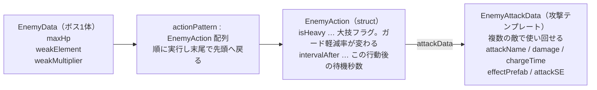
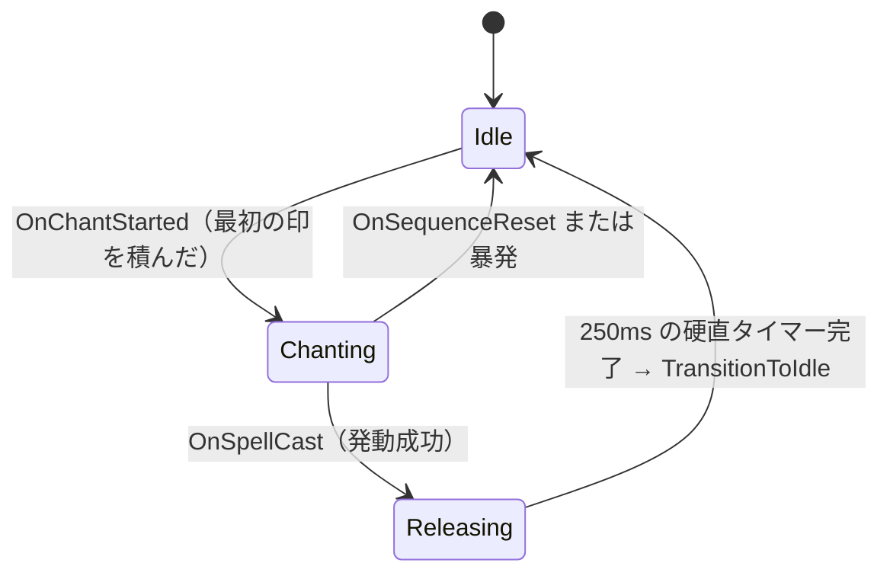
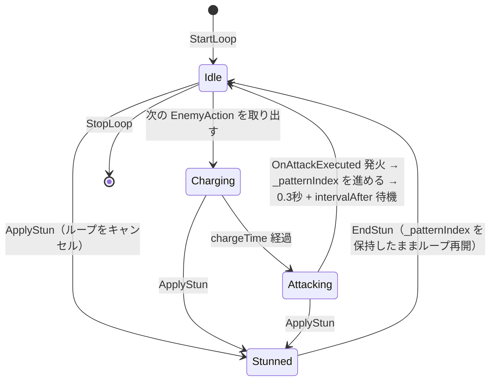

# ⚔️ バトルシステム

> **ドキュメント種別:** アーキテクチャ復習ドキュメント
> **対象:** `Scripts/Data/` `Scripts/Model/` `Scripts/Presenter/` `Scripts/View/`
> **関連:** [00_overview.md](00_overview.md) / [01_hand_input.md](01_hand_input.md)
> **仕様書:** §6 シーケンス管理 / §7 バトルシステム / §8 MVP構成

確定した印を受け取ってから、ダメージが出てHPバーが減るまで。

---

## 1. Data層 — ScriptableObject

`Scripts/Data/`。全レイヤーから参照される純粋なデータ。`SpellData` と `SpellEnums` は `namespace MUDRA.Data`、`EnemyData` 系はグローバル名前空間。

### SpellData（`Create > MUDRA > SpellData`）

| フィールド | 用途 | 使用状況 |
|---|---|---|
| `spellName` | 表示名。テロップに出る | ✅ |
| `element` | `ElementType`。敵の弱点との相性計算 | ✅ |
| `sequence` | `HandSign[]`。**発動印は含めない** | ✅ |
| `basePower` | 基礎威力。全Strategyの起点 | ✅ |
| `damageType` | `DamageType`。Strategyの選択に使う | ✅ |
| `hitCount` | MultiHit時のヒット数 | ✅ |
| `statusEffect` / `statusEffectDuration` | 副次効果の種類と持続秒数 | ✅ |
| `rangeType` | `AttackRangeType` | ⚠️ 未使用 |
| `icon` / `description` / `cutInSprite` | 図鑑・演出用 | ⚠️ 未使用 |
| `effectPrefab` / `castSE` | 術ごとの演出とSE | ⚠️ 未使用（B4/B7で接続） |

> **注意:** `SpellEffectView` は `SpellData.effectPrefab` ではなく**自分の `[SerializeField] _effectPrefab`** を使う。つまり現在どの術を撃っても同じエフェクトが出る。

### EnemyData / EnemyAttackData / EnemyAction



### enum（`Data/SpellEnums.cs`）

| enum | 値 |
|---|---|
| `ElementType` | Wind, Earth, Thunder, Water, Fire, Light |
| `AttackRangeType` | Single, Area |
| `StatusEffectType` | None, Slow, Stun, DamageOverTime（**Slow は実装クラス無し**） |
| `DamageType` | SingleHit, MultiHit, DamageOverTime |

---

## 2. SpellSequenceModel — 印の積み上げと発動判定

`Model/SpellSequenceModel.cs`。Pure C# / `IDisposable`。

### 保持するもの

```csharp
List<SpellData> _allSpells;        // 全術（不変）
List<HandSign>  _inputHistory;     // 積んだ印
List<SpellData> _matchCandidates;  // 前方一致で生き残っている候補
float           _chantStartTime;   // 詠唱開始時刻（速度ボーナス用）
```

### 3つの入口

| メソッド | 動作 |
|---|---|
| `AddSign(sign)` | 履歴に積む。**空→非空の瞬間に詠唱開始時刻を記録**し `OnChantStarted` 発火。`_matchCandidates` を「i番目の印が一致する術」だけに絞り込み、その後 `OnSignAdded` 発火 |
| `Release()` | 候補のうち **`sequence.Length == _inputHistory.Count`** のものを探す。見つかれば成功、無ければ暴発。どちらも `SpellCastResult` として `OnSpellCast` に流す |
| `Cancel()` | 履歴と候補をリセットし `OnSequenceReset(SequenceResetReason.Cancel)` |

> **設計意図:** 候補の絞り込みは**前方一致の逐次フィルタ**。1印積むたびに候補が減るので、`SequenceGuideView` は「今この印まで組むとどの術が狙えるか」をそのまま表示できる。

### 速度ボーナス

```csharp
threshold = 印数 × 1.0秒          // SpeedBonusTimePerSign
詠唱時間 <= threshold  →  ×1.5    // SpeedBonusMultiplier
それ以外                →  ×1.0
```

時刻取得は `Func<float> getTime` としてコンストラクタに注入される（`BattleInitializer` が `() => Time.time` を渡す）。**テスト時に偽の時計を差せるようにするため**の意図的な設計（A4）。

### SpellCastResult

```csharp
public readonly struct SpellCastResult
{
    public readonly bool      IsSuccess;   // false = 暴発
    public readonly SpellData Spell;       // 暴発時は null
    public readonly float     SpeedBonus;  // 暴発時は 1.0 固定
}
```

> **設計意図:** 成功と暴発を**別イベントに分けず1つの型に統合**している。購読側が「成功のとき」「暴発のとき」を `Where` で振り分ければよく、イベントの数が増えない。コンボ数を持たないのは、`SpellSequenceModel` にコンボ状態を知らせない設計を保つため（コンボは `BattleModel` の持ち物）。

### 4つの出力ストリーム

| ストリーム | 発火タイミング | 主な購読者 |
|---|---|---|
| `OnChantStarted` | 最初の印を積んだとき | `PlayerStateManager`（Idle→Chanting） |
| `OnSignAdded` | 印を積んで候補を絞った後 | `SequenceGuideView` |
| `OnSpellCast` | `Release()` 時（成功・暴発とも） | `BattleModel` / 各View / `PlayerStateManager` |
| `OnSequenceReset` | `Cancel()` 時 | ガイドクリア / `PlayerStateManager` |

---

## 3. BattleModel — HP・コンボ・勝敗

`Model/BattleModel.cs`。バトル全体の数値の持ち主。

### 公開している状態（R3）

```csharp
ReadOnlyReactiveProperty<int>  PlayerHp / BossHp   // 内部は ReactiveProperty
ReadOnlyReactiveProperty<int>  ComboCount
ReadOnlyReactiveProperty<bool> IsBattleActive
Observable<bool>               OnBattleEnd         // true = 勝利
int PlayerMaxHp / BossMaxHp                        // 不変
```

### ダメージの4経路

| メソッド | 呼び出し元 | 内容 |
|---|---|---|
| `ApplySpellDamage(result)` | `BattlePresenter`（`OnSpellCast` 購読） | 成功: Strategyで計算 → ボスHP減 → コンボ++ → 副次効果付与 ／ 暴発: `ApplyMisfireDamage` へ |
| `ApplyDotDamage(damage)` | `DotEffect` から `Action` 経由で毎秒 | ボスHPのみ減らす。**コンボ・速度倍率は乗せない**（初撃のみ適用の方針） |
| `ApplyEnemyDamage(action, isGuarding)` | `BattlePresenter`（`OnAttackExecuted` 購読） | ガード中なら軽減率を掛けてプレイヤーHP減 |
| `ApplyMisfireDamage()`（private） | 上記から | **MaxHPの5%**のセルフダメージ + コンボリセット |

### 定数

| 定数 | 値 | 意味 |
|---|---|---|
| `NormalGuardRate` | 0.5 | 通常攻撃をガードしたときのダメージ倍率 |
| `HeavyGuardRate` | 0.3 | 大技（`isHeavy`）をガードしたときの倍率 |
| `MisfireDamageRate` | 0.05 | 暴発セルフダメージ（MaxHP比） |

すべての経路が最後に `CheckBattleEnd()` を通り、どちらかのHPが0になった時点で `_isBattleActive = false` にして `OnBattleEnd` を1回だけ流す。

### 2段階初期化

```csharp
var battleModel = new BattleModel(playerMaxHp, enemyData);
var factory = new StatusEffectFactory(
    battleModel.ApplyDotDamage,      // Action<int>
    enemyStateManager.ApplyStun,     // Action
    enemyStateManager.EndStun);      // Action
battleModel.SetStatusEffectDependencies(statusEffectManager, factory);
```

> **設計意図:** コンストラクタで渡そうとすると `BattleModel` と `EnemyStateManager` が互いを必要として循環する。`Action` デリゲートで受け渡し、生成後に1回だけ注入することで、**Model同士がクラス参照を持たない**状態を保っている（A5）。

### デバッグ専用メンバ

`#if UNITY_EDITOR || DEVELOPMENT_BUILD` で囲われた `IsInvincible` / `DebugModifyPlayerHp` / `DebugModifyBossHp`。`DebugMenuView` から操作する。無敵中でも**暴発のコンボリセットだけは発生する**（ダメージだけ無効化）。

---

## 4. ダメージ計算 Strategy

`Model/Strategy/`。`SpellData.damageType` で実装を選ぶ（`BattleModel.ResolveCalculator`）。

```csharp
public interface IDamageCalculator
{
    DamageResult Calculate(SpellData spellData, EnemyData enemyData, float speedBonus, int comboCount);
}
```

### 共通倍率

| 倍率 | 式 |
|---|---|
| 弱点 | `spellData.element == enemyData.weakElement` なら `weakMultiplier`（ClayDollは 1.5）、でなければ 1.0 |
| 速度ボーナス | 1.5 または 1.0（`SpellSequenceModel` が算出済み） |
| コンボ | `1.0 + comboCount × 0.1` |

### 3つの実装

| Strategy | 式 |
|---|---|
| `SingleHitCalculator` | `basePower × 弱点 × 速度 × コンボ` |
| `MultiHitCalculator` | 1ヒット = `basePower ÷ hitCount × 弱点 × 速度 × コンボ`、合計 = 1ヒット × `hitCount` |
| `DamageOverTimeCalculator` | 初撃 = `basePower × 0.3 × 弱点 × 速度 × コンボ`<br>tick1回 = `basePower × 0.7 ÷ tick数 × 弱点`（tick数 = `statusEffectDuration ÷ 1.0秒`） |

> **MultiHitの端数について:** 1ヒットをintに丸めてから掛けるため、同じ `basePower` の SingleHit より合計が微妙に低くなる。**仕様として許容**するとコード中に明記されている。

`DamageResult` は public field を持つ mutable struct。`TotalDamage` / `PerHitDamage` / `HitCount` / `IsWeakness` / `HasSpeedBonus` / `AppliedEffect` / `EffectDuration` / `PerTickDamage` / `TickCount`。`PerHitDamage` と `HitCount` は View 側の時間差ヒット表示用に用意されているが**まだ使われていない**（B4）。

---

## 5. StatusEffect — 時限効果

`Model/StatusEffect/`。

```csharp
public interface IStatusEffect
{
    StatusEffectType Type { get; }
    bool IsExpired { get; }
    void OnApply();              // 開始時1回
    void OnTick(float deltaTime); // 毎フレーム
    void OnExpire();             // 終了時1回
}
```

| クラス | 役割 |
|---|---|
| `StatusEffectManager` | アクティブな効果をListで保持。`BattlePresenter.Update()` から `Tick(deltaTime)`。**同種の効果は重複不可**（既に同じ `Type` があれば無視）。バトル終了時は `ClearAll()` |
| `StatusEffectFactory` | `DamageResult.AppliedEffect` を見て `DotEffect` / `StunEffect` を生成。`None` なら null。生成に必要な処理は全て `Action` で受け取っており、**BattleModel / EnemyStateManager への参照を持たない** |
| `DotEffect` | 残り時間を減らしつつ、1.0秒 tick ごとに `_applyDamage(perTickDamage)` を呼ぶ。初撃は `BattleModel` 側で処理済みなので、ここは tick のスケジュール管理のみ |
| `StunEffect` | `OnApply` で `EnemyStateManager.ApplyStun()`、`OnExpire` で `EndStun()`。時間管理は `OnTick` |

### GuardWindowManager

`IStatusEffect` ではなく単体のクラス。`BattlePresenter.Update()` から `Tick(deltaTime)` で駆動。

```csharp
Activate()          // Guard印確定時に呼ぶ。受付窓を開く
bool IsGuarding     // 残り時間 > 0
private const float WindowDuration = 1f;
```

> **設計意図:** A5 で「構え続けるガード」から**タイミングガード**に方針転換した。`PlayerPhase` から独立させているので、**詠唱中でもガードできる**。`PlayerPhase` に `Guarding` を追加しなかったのはこのため（仕様書 §4-2）。
>
> ※ クラスのXMLコメントは「0.5秒の受付窓」と書いているが、定数は `1f`。実装値は1秒。

---

## 6. 状態管理

### プレイヤー：Stateパターン

`Model/PlayerStateManager.cs` + `Model/State/`。



`IPlayerState { Phase, Enter(), Exit() }` を `IdleState` / `ChantingState` / `ReleasingState` が実装。前2つは中身が空のシェル。`ReleasingState` だけが実処理を持ち、`Enter()` で 250ms（`RecoveryDurationMs`）の UniTask タイマーを回し、完了したら `PlayerStateManager.TransitionToIdle()` を呼ぶ。`Exit()` で CTS をキャンセルするので、硬直中に別状態へ飛んでもタイマーが暴発しない。

遷移の入口 `HandleChantStarted` / `HandleSpellCast` / `HandleSequenceReset` は**自分で購読せず、`HandSignPresenter` から呼ばれる**。フェーズは `ReadOnlyReactiveProperty<PlayerPhase> CurrentPhase` で公開。

### 敵：enum + UniTaskループ

`Model/EnemyStateManager.cs`。**あえて Stateパターンを使っていない**（仕様書 §2 に明記）。



| メソッド | 動作 |
|---|---|
| `StartLoop()` | 既存ループを止めてから `_patternIndex = 0` で開始。`actionPattern` 未設定なら `LogError` |
| `StopLoop()` | CTSキャンセル + Idleへ。バトル終了・シーン破棄時 |
| `ApplyStun()` | ループを止めて `Stunned` へ。**`_patternIndex` は保持する** |
| `EndStun()` | Idle に戻して**中断された位置からループ再開** |

`OperationCanceledException` はキャンセル＝正常終了として握り潰す。

---

## 7. Presenter — 配線一覧

ロジックは書かない。「誰のどのストリームを購読して、誰の何を呼ぶか」だけ。

### HandSignPresenter

`Update()` で `HandTrackingService.Tick()` を回す。ただし `_debugKeyboardInput` が割り当てられている場合は **Tick を回さず**、キーボード入力を直接 `HandleSignConfirmed` に流す（`#if UNITY_EDITOR || DEVELOPMENT_BUILD`）。

**印の意味づけはここで行われる。**

```csharp
private void HandleSignConfirmed(HandSign sign)
{
    switch (sign)
    {
        case HandSign.Release: _model.Release(); break;
        case HandSign.Cancel:  _model.Cancel();  break;
        case HandSign.Guard:   _guardWindowManager.Activate(); break;
        default:               _model.AddSign(sign); break;   // 詠唱印
    }
}
```

| 購読するストリーム | 呼ぶもの |
|---|---|
| `HandTrackingService.OnHandSignRecognized` | `HandleSignConfirmed`（上記）/ デバッグテキスト更新 |
| `SpellSequenceModel.OnSignAdded` | `SequenceGuideView.UpdateGuide(MatchCandidates, InputCount)` + `PlayConfirmEffect()` |
| `OnSpellCast` | ガイド `Clear()` → 成功なら `SpellEffectView.PlayEffect()` + `SpellTelopView.ShowSpellName()`、暴発なら `ShowMisfire()` |
| `OnSpellCast`（成功のみ） | `PlayerStateManager.HandleSpellCast()` |
| `OnSpellCast`（暴発のみ） / `OnSequenceReset` | `PlayerStateManager.HandleSequenceReset()` |
| `OnChantStarted` | `PlayerStateManager.HandleChantStarted()` |

### BattlePresenter

`Update()` で `StatusEffectManager.Tick()` と `GuardWindowManager.Tick()` を回す。

| 購読するストリーム | 呼ぶもの |
|---|---|
| `BattleModel.PlayerHp` / `BossHp`（`.Skip(1)`） | `HpBarView.SetHp(hp, maxHp)` ※初期表示は `InitializeHp` で別途 |
| `BattleModel.ComboCount` / `OnBattleEnd` | 現状 `Debug.Log` のみ（B4で演出接続） |
| `EnemyStateManager.OnAttackExecuted` | `BattleModel.ApplyEnemyDamage(action, guardWindow.IsGuarding)` |
| `EnemyStateManager.CurrentPhase` | `Debug.Log` |
| `SpellSequenceModel.OnSpellCast` | `BattleModel.ApplySpellDamage(result)` |
| `SpellSequenceModel.OnSequenceReset` | `Debug.Log`（UI演出フックの予定地） |

`.Skip(1)` は `ReactiveProperty` が購読時に現在値を流すため、初期値での余計なアニメーションを避ける目的。

### BattleInitializer

起動順は [00_overview.md §4](00_overview.md#4-起動シーケンス) を参照。

---

## 8. View

いずれも Model を一切参照しない MonoBehaviour。演出は LitMotion。

| View | 公開メソッド | 中身 |
|---|---|---|
| `HpBarView` | `InitializeHp` / `SetHp` | **2層バー**。`_currentBar` が 0.2秒で即追従（OutQuad）、`_delayedBar` が 0.5秒待ってから 0.6秒かけて追従（InOutSine）。連続ダメージ時は前の `MotionHandle` を `Cancel()` してから張り直す。プレイヤー・ボス共用 |
| `SequenceGuideView` | `UpdateGuide` / `PlayConfirmEffect` / `Clear` | 候補術を**最大4件**、`_candidateRowPrefab` / `_signSlotPrefab` から動的生成。確定済みスロットは色を変え、最後に確定したスロットにスケールパンチ（OutBack）を当てる。印→漢字は `GetSignDisplayName()`（開/握/指/刃/掌/合/双。**未定義は「？」**） |
| `SpellTelopView` | `ShowSpellName` / `ShowMisfire` | 画面中央テキスト。フェードイン0.15s → 維持0.8s → フェードアウト0.4s。成功は金色、暴発は赤。1つの TextMeshProUGUI を共用（排他的なので） |
| `SpellEffectView` | `PlayEffect` | `_spawnPoint` に `_effectPrefab` を Instantiate。保険として `_safetyDestroyDelay` 後に強制破棄 |

`MotionHandle` は struct なので、キャンセル前に必ず `IsActive()` を確認するのが共通の作法。

---

## 9. 設計判断の要約

詳細な検討過程は各devlogにある。ここは「なぜそうなっているか」の索引。

| 判断 | 理由 | 出典 |
|---|---|---|
| Model を Pure C#（MonoBehaviour非継承）にする | テスト可能にし、Unityライフサイクルから切り離す。駆動は Presenter の `Tick` に委ねる | A1 |
| 印判定をテーブル駆動にする | 新しい印の追加を**配列1行**で完結させる | B2 |
| Union判定を手のひら長基準の比率にする | 正規化座標のためカメラ距離で絶対値が変わる。比率にして距離非依存にする | B2 |
| 成功と暴発を `SpellCastResult` 1つに統合 | イベントを増やさず、購読側で `Where` 分岐すれば済む | A4 |
| 時刻取得を `Func<float>` で注入 | テスト時に偽の時計を差せるようにする | A4 |
| ガードを「構え」から**タイミングガード**へ | `PlayerPhase` から独立させ、詠唱中もガード可能にする | A5 |
| 敵は Stateパターンではなく enum + UniTaskループ | 状態ごとの振る舞いが薄く、時間駆動のシーケンスなのでループのほうが素直 | A2 |
| `StatusEffectFactory` に `Action` を注入 | Model同士がクラス参照を持たず、循環依存を作らない | A5 |
| DoT の倍率は初撃のみ | tick まで倍率を乗せると総ダメージが膨らみすぎる | A3 / A5 |

---

## 10. 気をつける点

- `BattlePresenter.Initialize` の引数名が `_playerHpBarView` / `_bossHpBarView` とフィールド名と同じため、**フィールドへの代入が行われていない**。購読ラムダが引数をクロージャで捕まえているので動作はしている
- `SpellEffectView` は `SpellData.effectPrefab` を見ないので、全術で同じエフェクトが出る（B4で接続予定）
- `SequenceGuideView.GetSignDisplayName()` は `Release` / `Cancel` / `Guard` を持たない。ただしこれらは `sequence` に入らないので実害は無い
- `BattleModel.ResolveCalculator()` は呼ばれるたびに Calculator を `new` する。ステートレスなので問題は無いが、再利用の余地はある
